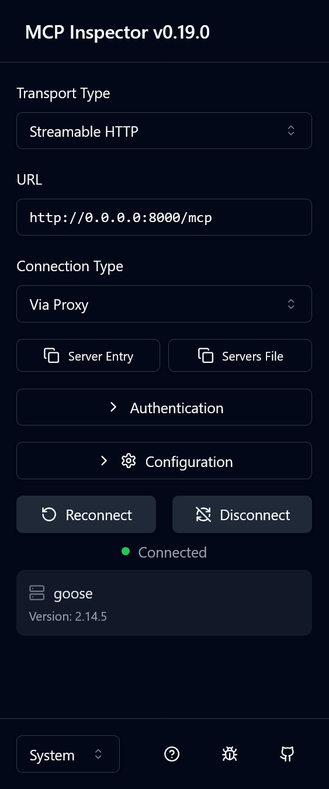
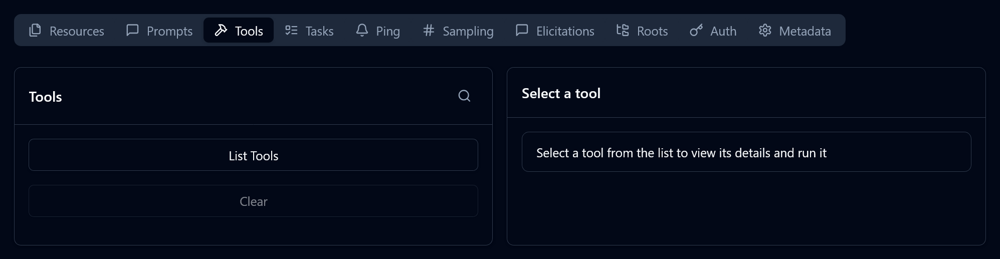
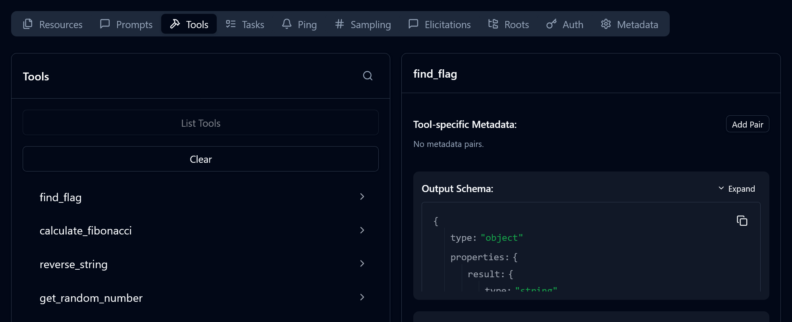

# MCP
## Step 1
Realise that the provided IP and port combo is an MCP server. This can be done by going to http://IP:PORT/mcp and seeing a response.

## Step 2
Use a MCP client / inspector to see all of the resources, prompts, and tools. 

Example inspector:
`npx @modelcontextprotocol/inspector --url http://IP:PORT/mcp`

## Step 3
Open the website hosted by the MCP inspector. On the left hand side panel, make sure that the transport type is `Streamable HTTP`, that the URL matches the specified IP address and port, and that the connection type is `Via Proxy`.  THhen click connect.

## Step 4
Click `Tools` in the top menu bar, and then click `List Tools`, this lists all of the tools that the MCP server makes available.

## Step 5
One tool should stand out. The `find_flag` tool. When clicked, the metadata will appear on the right. Scrolling down shows some more options, select `Run Tool`.

## Step 6
After running the structured content will contain the flag for the. Similarly the unstructured content will also include the flag.