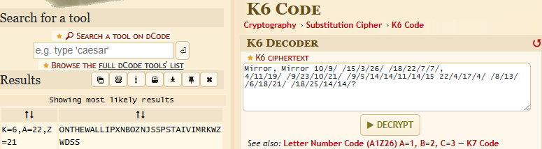
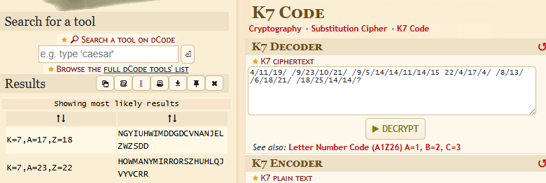
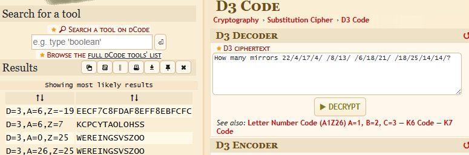
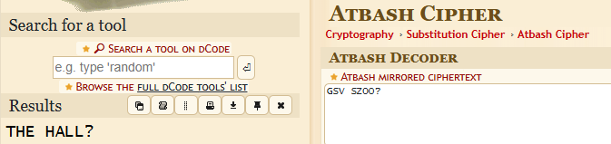
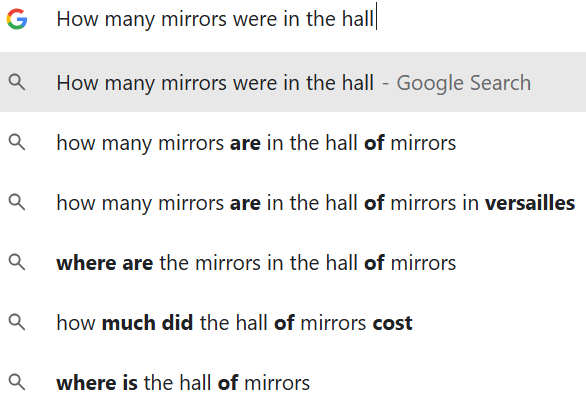

# Mirror Mirror Writeup

**Fun Fact:** This challenge was originally inspired by a challenge from the 2018 CyberFirst Girls Competition. I then went totally off-script so it no longer bears any resemblance whatsoever.


## Solving the Challenge

The way this challenge works is the original plaintext was split into chunks. Each chunk has been encoded with a different method and some methods were used on multiple chunks.

### Step 1

The initial ciphertext is as follows

```
?/41/41/52/81/ /12/81/6/ /31/8/ /4/71/4/22 51/41/11/41/41/5/9/ /12/01/32/9/ /91/11/4
,/7/7/22/81/ /62/3/51/ /9/01 rorriM ,rorriM
```

At the end of this we can see the challenge's name written in reverse. This correlates with the fact my friend said he would look in a mirror before beginning the trip. To work towards the plaintext, we can reverse the order of all the symbols in the file to end up with the following:

```
Mirror, Mirror 10/9/ /15/3/26/ /18/22/7/7/,
4/11/19/ /9/23/10/21/ /9/5/14/14/11/14/15 22/4/17/4/ /8/13/ /6/18/21/ /18/25/14/14/?
```

The first part of the plaintext is therefore `Mirror Mirror`.

### Step 2

My friend was then going to start his trip in the Cassis, France. Cassis can be written as `K6` (as it is pronounced similarly to Cassis when said in French). The next step of the decoding process is therefore to decode the ciphertext using the K6 Code. This can be done using the [dcode](https://www.dcode.fr/k6-code) website:



This shows that the next part of the plaintext is `on the wall`.

### Step 3

The ciphertext at this stage is now:
```
Mirror, Mirror on the wall,
4/11/19/ /9/23/10/21/ /9/5/14/14/11/14/15 22/4/17/4/ /8/13/ /6/18/21/ /18/25/14/14/?
```

We know my friend was going to listen to a cassette on the next leg of his journey. This can be written as `K7` (as it is pronounced similarly to cassette when said in French). The next step of the decoding process is therefore to decode the ciphertext using the K7 Code. This can be done using the [dcode](https://www.dcode.fr/k7-code) website:



This shows that the next part of the plaintext is `How many mirrors`.

### Step 4

The ciphertext at this stage is now:
```
Mirror, Mirror on the wall,
How many mirrors 22/4/17/4/ /8/13/ /6/18/21/ /18/25/14/14/?
```

We know my friend was headed to Le Détroit next. Detroit can be written as `D3` (as it is pronounced similarly to Detroit when said in French). The next step of the decoding process is therefore to decode the ciphertext using the D3 Code. This can be done using the [dcode](https://www.dcode.fr/d3-code) website:



This shows that the next part of the plaintext is `were in GSV SZOO`.

### Step 5

The ciphertext at this stage is now:
```
Mirror, Mirror on the wall,
How many mirrors were in GSV SZOO?
```

Before reaching the final destination, Versailles, my friend thought he would encounter another mirror. This indicates that the cipher is mirror related. The final part of the ciphertext is encoded with the Atbash cipher which mirrors the alphabet. In other words A becomes Z, B becomes Y and so on. The final part of the ciphertext can be decoded using the [dcode](https://www.dcode.fr/atbash-cipher) website:



This shows that the final part of the plaintext is `the hall?`.

### Step 6

The plaintext has then been fully recovered:
```
Mirror Mirror on the wall
How many mirrors were in the hall?
```

If you Google `How many mirrors were in the hall?`, Google's autocomplete will help you out and reveal which hall this question refers to:



The question asks how many mirrors were in the Hall of Mirrors at the Palace of Versailles. (Hence why my friend was headed to Versailles!) The answer to this trivia question is [357](https://en.chateauversailles.fr/discover/estate/palace/hall-mirrors#the-hall-of-mirrors) meaning the final flag is `GooseCTF{357}`.
